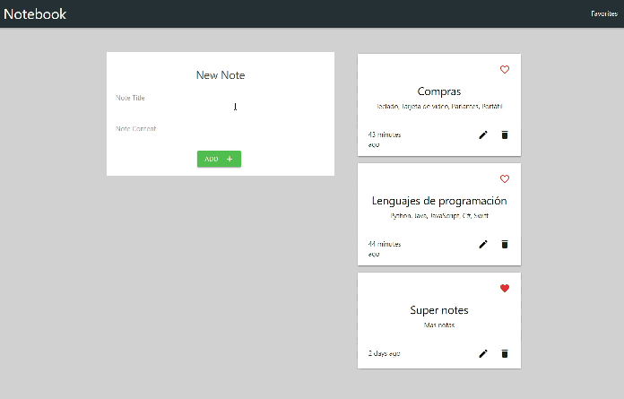

# [Notebook Web](https://kulnois.github.io/notebook-react)

Proyecto de React con Hooks, react-redux, redux, redux-thunk, firebase; para la creación de una aplicación sencilla donde se pueden crear, editar, eliminar y agregar a favoritos notas. Para el estado de la aplicación uso [redux](https://redux.js.org/basics/usage-with-react), para almacenar los datos [Cloud Firestore](https://firebase.google.com/docs/firestore), para las rutas [react-router-dom](https://reactrouter.com/web/guides/quick-start) y para trabajar con fechas [moment](https://momentjs.com/).

[Ver Notebook Web](https://kulnois.github.io/notebook-react).

### Recursos

* [React](https://reactjs.org/)
* [Hooks](https://reactjs.org/docs/hooks-intro.html)
* [react-router-dom](https://reactrouter.com/web/guides/quick-start)
* [Redux](https://redux.js.org/basics/usage-with-react)
* [Cloud Firestore](https://firebase.google.com/docs/firestore)
* [Moment](https://momentjs.com/)
* El proyecto es creado con [Create React apps](https://github.com/facebook/create-react-app)
* [Materialize](https://materializecss.com/getting-started.html)

## Instalación
1. [Download](../../archive/master.zip) o clonar el repositorio.
2. Instalar dependencias con `npm install`.

## Server

### Desarrollo

Ejecutar `npm start` e ir al navegador a la ruta [http://localhost:3000](http://localhost:3000).

### Producción

Ejecutar `npm run build` el cual le genera una carpeta `build` donde están los archivos estáticos los cuales ya puede subir a un servidor web.